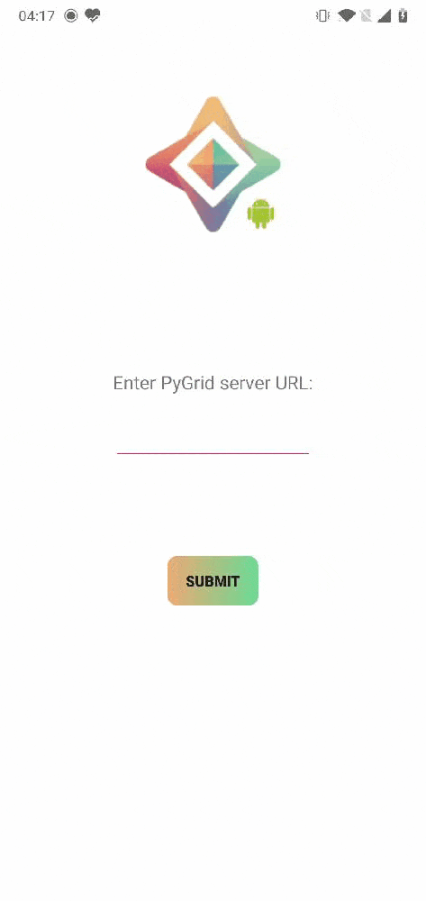
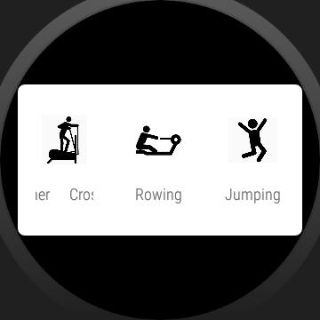

[](https://openmined.slack.com/messages/lib_kotlin_syft)
[  ](https://bintray.com/openmined/KotlinSyft/syft/_latestVersion)

<!-- ALL-CONTRIBUTORS-BADGE:START - Do not remove or modify this section -->
[](#contributors-)
<!-- ALL-CONTRIBUTORS-BADGE:END -->

# KotlinSyft

KotlinSyft makes it easy for you to **train and inference PySyft models on Android devices**. This allows you to utilize training data located directly on the device itself, bypassing the need to send a user's data to a central server. This is known as [federated learning](https://ai.googleblog.com/2017/04/federated-learning-collaborative.html).

- :gear: **Training and inference** of any PySyft model written in PyTorch or TensorFlow
- :bust_in_silhouette: Allows all data to stay on the user's device
- :zap: Support for full multi-threading / background service execution
- :key: Support for **JWT authentication** to protect models from Sybil attacks
- :+1: A set of **inbuilt best practices** to prevent apps from over using device resources.
  - :electric_plug: **Charge detection** to allow background training only when device is connected to charger
  - :zzz: **Sleep and wake detection** so that the app does not occupy resource when user starts using the device
  - :money_with_wings: **Wifi and metered network detection** to ensure the model updates do not use all the available data quota
  - :no_bell: All of these smart defaults are easily are **overridable**
- :mortar_board: Support for both reactive and callback patterns so you have your freedom of choice (_in progress_)
- :lock: Support for **secure multi-party computation** and **secure aggregation** protocols using **peer-to-peer WebRTC** connections (_in progress_).

There are a variety of additional privacy-preserving protections that may be applied, including [differential privacy](https://towardsdatascience.com/understanding-differential-privacy-85ce191e198a), [muliti-party computation](https://www.inpher.io/technology/what-is-secure-multiparty-computation), and [secure aggregation](https://research.google/pubs/pub45808/).

[OpenMined](https://openmined.org) set out to build the **world's first open-source ecosystem for federated learning on web and mobile**. KotlinSyft is a part of this ecosystem, responsible for bringing secure federated learning to Android devices. You may also train models on iOS devices using [SwiftSyft](https://github.com/OpenMined/SwiftSyft) or in web browsers using [syft.js](https://github.com/OpenMined/syft.js).

If you want to know how scalable federated systems are built, [Towards Federated Learning at Scale](https://arxiv.org/pdf/1902.01046.pdf) is a fantastic introduction!

## Installation

KotlinSyft is available on maven and jcenter. To add the library as a dependency in your android project use one of the following methods:

1. Maven snippet:

```xml
<dependency>
  <groupId>org.openmined.kotlinsyft</groupId>
  <artifactId>syft</artifactId>
  <version>0.1.3</version>
  <type>pom</type>
</dependency>
```

2. Gradle dependency:

```groovy
implementation 'org.openmined.kotlinsyft:syft:0.1.3'
```

## Quick Start

As a developer, there are few steps to building your own secure federated learning system upon the OpenMined infrastructure:

1. :robot: Generate your secure ML model using [PySyft](https://github.com/OpenMined/PySyft). By design, PySyft is built upon PyTorch and TensorFlow so you **don't need to learn a new ML framework**. You will also need to write a training plan (training code the worker runs) and an averaging plan (code that PyGrid runs to average the model diff).
2. :earth_americas: Host your model and plans on [PyGrid](https://github.com/OpenMined/PyGrid) which will deal with all the federated learning components of your pipeline. You will need to set up a PyGrid server somewhere, please see their installation instructions on how to do this.
3. :tada: Start training on the device!

**:notebook: The entire workflow and process is described in greater detail in our [project roadmap](https://github.com/OpenMined/Roadmap/blob/master/federated_learning/projects/model_centric_fl.md).**

You can use KotlinSyft as a front-end or as a background service. The following is a quick start example usage:

```kotlin
    val userId = "my Id"

    // Optional: Make an http request to your server to get an authentication token
    val authToken = apiClient.requestToken("https://www.mywebsite.com/request-token/$userId")

    // The config defines all the adjustable properties of the syft worker
    // The url entered here cannot define connection protocol like https/wss since the worker allots them by its own
    // `this` supplies the context. It can be an activity context, a service context, or an application context.
    val config = SyftConfiguration.builder(this, "www.mypygrid-url.com").build()

    // Initiate Syft worker to handle all your jobs
    val syftWorker = Syft.getInstance(authToken, configuration)

    // Create a new Job
    val newJob = syftWorker.newJob("mnist", "1.0.0")

    // Define training procedure for the job
    val jobStatusSubscriber = object : JobStatusSubscriber() {
        override fun onReady(
            model: SyftModel,
            plans: ConcurrentHashMap<String, Plan>,
            clientConfig: ClientConfig
        ) {
            // This function is called when KotlinSyft has downloaded the plans and protocols from PyGrid
            // You are ready to train your model on your data
            // param model stores the model weights given by PyGrid
            // param plans is a HashMap of all the planIDs and their plans.
            // ClientConfig has hyper parameters like batchsize, learning rate, number of steps, etc

            // Plans are accessible by their plan Id used while hosting it on PyGrid.
            // eventually you would be able to use plan name here
            val plan = plans["plan name"]

            repeat(clientConfig.properties.maxUpdates) { step ->

                // get relevant hyperparams from ClientConfig.planArgs
                // All the planArgs will be string and it is upon the user to deserialize them into correct type
                val batchSize = (clientConfig.planArgs["batch_size"]
                                 ?: error("batch_size doesn't exist")).toInt()
                val batchIValue = IValue.from(
                    Tensor.fromBlob(longArrayOf(batchSize.toLong()), longArrayOf(1))
                )
                val lr = IValue.from(
                    Tensor.fromBlob(
                        floatArrayOf(
                            (clientConfig.planArgs["lr"] ?: error("lr doesn't exist")).toFloat()
                        ),
                        longArrayOf(1)
                    )
                )
                // your custom implementation to read a databatch from your data
                val batchData = dataRepository.loadDataBatch(clientConfig.batchSize)
                //get Model weights and return if not set already
                val modelParams = model.getParamArray() ?: return
                val paramIValue = IValue.listFrom(*modelParams)
                // plan.execute runs a single gradient step and returns the output as PyTorch IValue
                val output = plan.execute(
                    batchData.first,
                    batchData.second,
                    batchIValue,
                    lr,paramIValue
                )?.toTuple()
                // The output is a tuple with outputs defined by the pysyft plan along with all the model params
                output?.let { outputResult ->
                    val paramSize = model.modelState!!.syftTensors.size
                    // The model params are always appended at the end of the output tuple
                    val beginIndex = outputResult.size - paramSize
                    val updatedParams =
                            outputResult.slice(beginIndex until outputResult.size)
                    // update your model. You can perform any arbitrary computation and checkpoint creation with these model weights
                    model.updateModel(updatedParams.map { it.toTensor() })
                    // get the required loss, accuracy, etc values just like you do in Pytorch Android
                    val accuracy = outputResult[0].toTensor().dataAsFloatArray.last()
                }
            }
            // Once training finishes generate the model diff
            val diff = mnistJob.createDiff()
            // Report the diff to PyGrid and finish the cycle
            mnistJob.report(diff)
        }

        override fun onRejected() {
        // Implement this function to define what your worker will do when your worker is rejected from the cycle
        }

        override fun onError(throwable: Throwable) {
        // Implement this function to handle error during job execution
        }
    }

    // Start your job
    newJob.start(jobStatusSubscriber)

    // Voila! You are done.
```

### Running the Demo App

The demo app fetches the plans, protocols and model weights from pygrid server hosted locally. The plans are then deserialized and executed using libtorch.

<p align="center">

</p>

Follow these steps to setup an environment to run the demo app:

- Clone the repo [PyGrid](https://github.com/OpenMined/PyGrid) and change directory to it. At the moment PyGrid doesn't have official releases so please use this [commit](0e93aa645a63a02f45ae72b4ff3106c6402dbadf)  

```bash
git clone https://github.com/OpenMined/PyGrid
cd PyGrid
git checkout 0e93aa645a63a02f45ae72b4ff3106c6402dbadf
```

- Follow [PyGrid: getting started](https://github.com/OpenMined/PyGrid/#getting-started) to run a local instance of PyGrid Node

- Install [PySyft](https://github.com/OpenMined/PySyft) at `commit 9d4f8e3ebecc4a00428607403832c5628753f1fc` in the virtual environment.

```bash
git clone https://github.com/OpenMined/PySyft
cd PySyft
git checkout 9d4f8e3ebecc4a00428607403832c5628753f1fc
virtualenv -p python3 venv
source venv/bin/activate
make venv
```

- From PySyft folder, start Jupyter Notebook

```bash
jupyter notebook
```

- Open a browser and navigate to [localhost:8888](http://localhost:8888/). You should be able to see the PySyft files.
- In the Jupyter Notebook, navigate to `examples/tutorials/model-centric-fl`
- Run the notebook `Part 01 - Create Plan.ipynb`. It should host the model on PyGrid.
- Optionally, run the notebook `Part 02 - Execute Plan.ipynb`. This will train the model on the python worker of PySyft.
- The android app connects to your PC's localhost via router (easier approach)
- Get the IP address of your computer by running `ip address show | grep "inet " | grep -v 127.0.0.1` if using Linux/Mac. For windows there are different steps. Alternatively, if you want to run the demo app in the emulator, use `10.0.2.2` as the IP address.
- Use this IP address and the port (default:5000) in your login screen to supply the PyGrid server url, e.g., 10.0.2.2:5000

## Built on KotlinSyft



[Federated-Wearables](https://github.com/FL-Wearable/Trainer) is a demo app for cross-device federated learning over wearables. The smartwatch app offloads the collected data to the paired phone app via Bluetooth for training in FL, and gets the updated model to run interface in real time.

## Contributing

1. Star, fork, and clone the repo
2. Open Android Studio and import project
3. Do your work.
4. Push to your fork
5. Submit a PR to OpenMined/KotlinSyft

Read the [contribution guide](https://github.com/OpenMined/.github/blob/master/CONTRIBUTING.md) as a good starting place. Additionally, we welcome you to the [slack](http://slack.openmined.org/) for queries related to the library and contribution in general. The Slack channel `#lib_kotlin_syft` is specific to KotlinSyft development, the Slack channel `#lib_syft_mobile` is meant for both Android and iOS teams. See you there!

## Contributors

These people were integral part of the efforts to bring KotlinSyft to fruition and in its active development.

<!-- ALL-CONTRIBUTORS-LIST:START - Do not remove or modify this section -->
<!-- prettier-ignore-start -->
<!-- markdownlint-disable -->
<table>
  <tr>
    <td align="center"><a href="http://vkkhare.github.io"><br /><sub><b>varun khare</b></sub></a><br /><a href="https://github.com/OpenMined/KotlinSyft/commits?author=vkkhare" title="Code">💻</a> <a href="https://github.com/OpenMined/KotlinSyft/commits?author=vkkhare" title="Tests">⚠️</a> <a href="https://github.com/OpenMined/KotlinSyft/commits?author=vkkhare" title="Documentation">📖</a> <a href="#design-vkkhare" title="Design">🎨</a> <a href="#infra-vkkhare" title="Infrastructure (Hosting, Build-Tools, etc)">🚇</a></td>
    <td align="center"><a href="https://github.com/mccorby"><br /><sub><b>Jose A. Corbacho</b></sub></a><br /><a href="https://github.com/OpenMined/KotlinSyft/commits?author=mccorby" title="Code">💻</a> <a href="https://github.com/OpenMined/KotlinSyft/commits?author=mccorby" title="Tests">⚠️</a> <a href="#design-mccorby" title="Design">🎨</a> <a href="https://github.com/OpenMined/KotlinSyft/commits?author=mccorby" title="Documentation">📖</a> <a href="#infra-mccorby" title="Infrastructure (Hosting, Build-Tools, etc)">🚇</a></td>
    <td align="center"><a href="http://ravikantsingh.com"><br /><sub><b>Ravikant Singh</b></sub></a><br /><a href="https://github.com/OpenMined/KotlinSyft/commits?author=IamRavikantSingh" title="Code">💻</a> <a href="https://github.com/OpenMined/KotlinSyft/commits?author=IamRavikantSingh" title="Documentation">📖</a></td>
    <td align="center"><a href="https://github.com/codeboy5"><br /><sub><b>Saksham Rastogi</b></sub></a><br /><a href="https://github.com/OpenMined/KotlinSyft/commits?author=codeboy5" title="Documentation">📖</a></td>
    <td align="center"><a href="https://www.patrickcason.com"><br /><sub><b>Patrick Cason</b></sub></a><br /><a href="https://github.com/OpenMined/KotlinSyft/commits?author=cereallarceny" title="Documentation">📖</a> <a href="#business-cereallarceny" title="Business development">💼</a></td>
    <td align="center"><a href="http://galalen.github.io"><br /><sub><b>Mohammed Galalen</b></sub></a><br /><a href="https://github.com/OpenMined/KotlinSyft/commits?author=galalen" title="Documentation">📖</a> <a href="https://github.com/OpenMined/KotlinSyft/commits?author=galalen" title="Tests">⚠️</a></td>
    <td align="center"><a href="https://github.com/erksch"><br /><sub><b>Erik Ziegler</b></sub></a><br /><a href="https://github.com/OpenMined/KotlinSyft/issues?q=author%3Aerksch" title="Bug reports">🐛</a></td>
  </tr>
  <tr>
    <td align="center"><a href="https://pengyuan-zhou.github.io/"><br /><sub><b>Pengyuan Zhou</b></sub></a><br /><a href="#tutorial-pengyuan-zhou" title="Tutorials">✅</a> <a href="#infra-pengyuan-zhou" title="Infrastructure (Hosting, Build-Tools, etc)">🚇</a></td>
  </tr>
</table>

<!-- markdownlint-enable -->
<!-- prettier-ignore-end -->
<!-- ALL-CONTRIBUTORS-LIST:END -->

## License

[Apache License 2.0](https://choosealicense.com/licenses/apache-2.0/)
